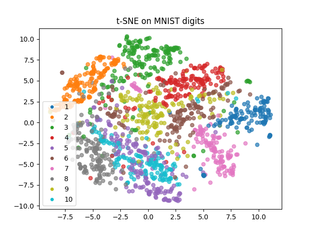
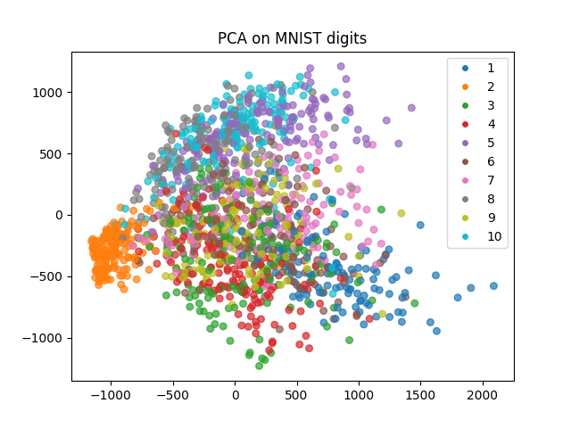

# A study in dimensionality reduction techniques

Implementation of various dimensionality reduction techniques including 

    - Principal Component Analysis (PCA)
    - t-distributed Stochastic Neighbor Embedding (t-SNE)
    - and more to come!

## Examples

